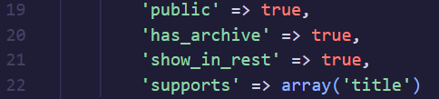
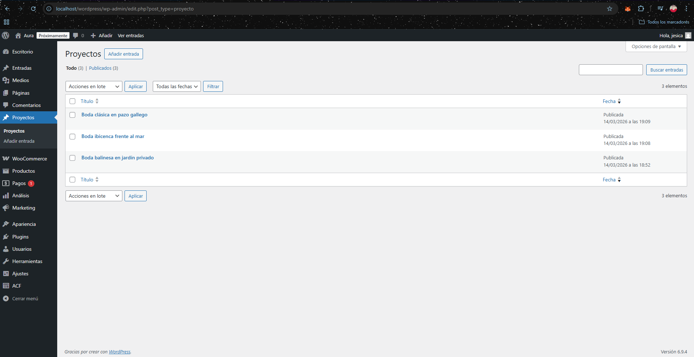
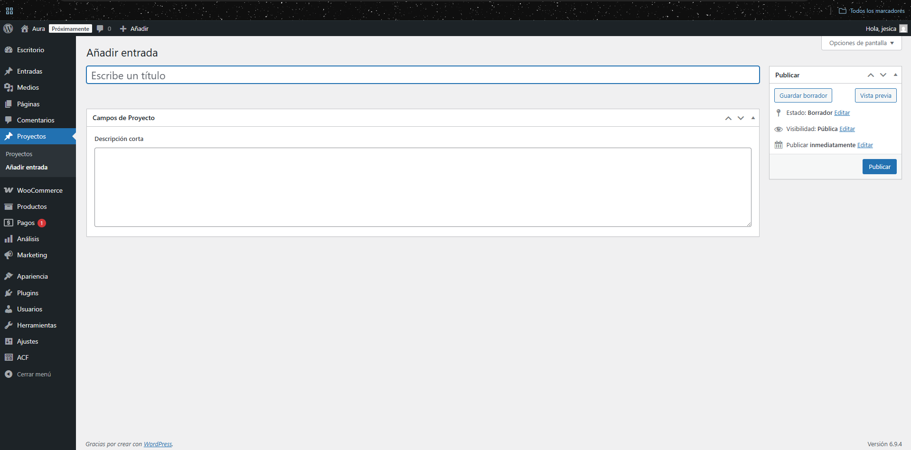
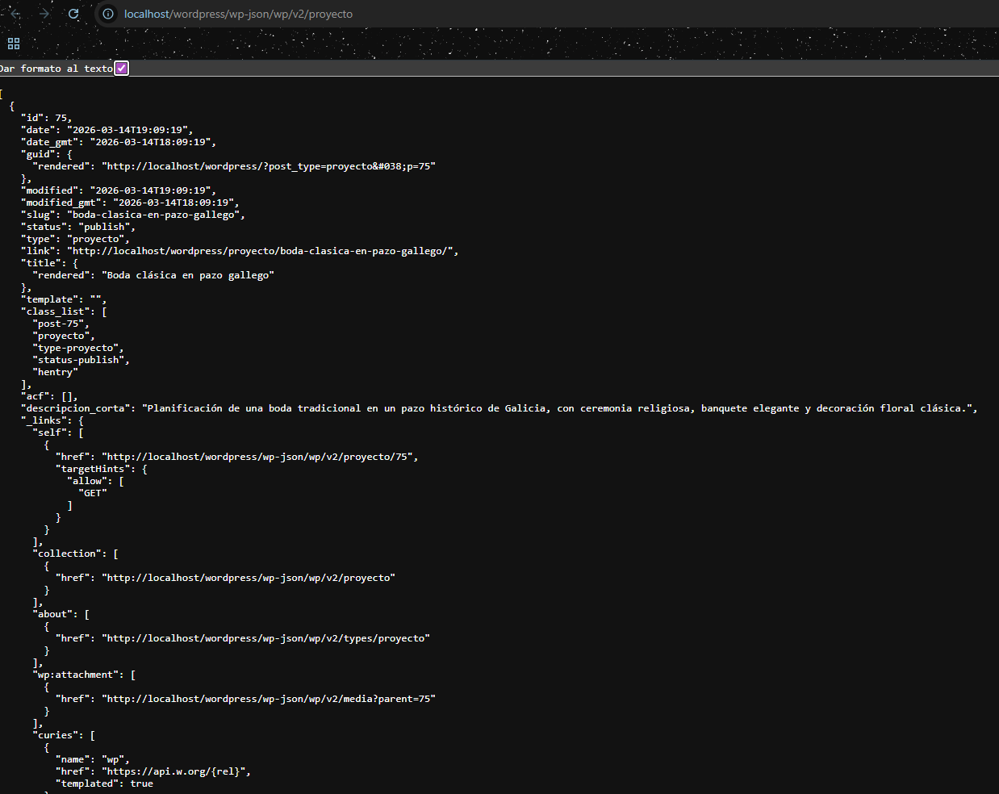
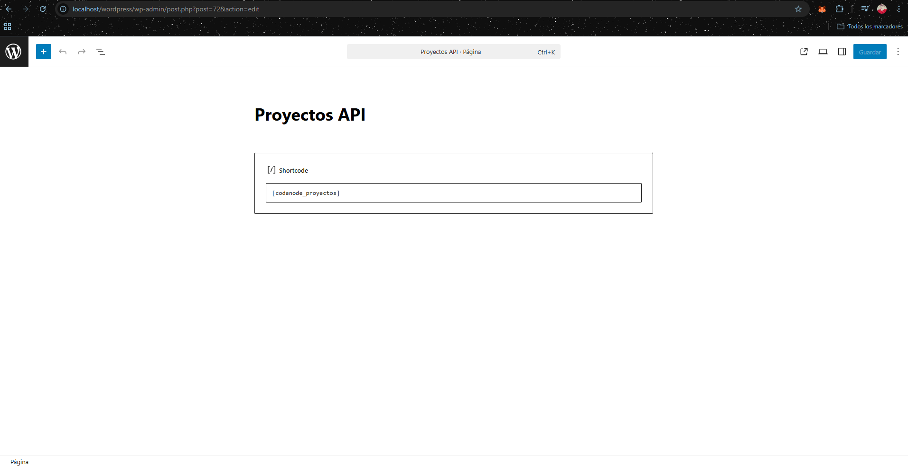
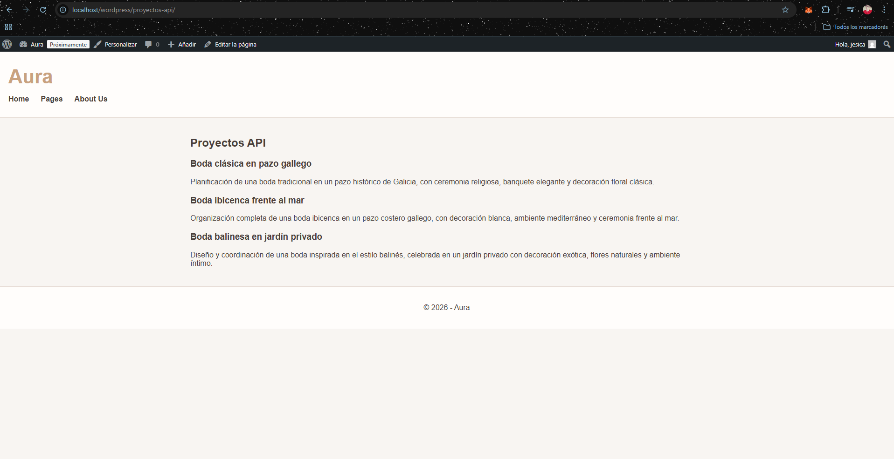

# CodeNode – Semana 4 WordPress REST API

## Descripción

En esta práctica se desarrolló un plugin personalizado de WordPress para registrar un **Custom Post Type (CPT)** llamado `proyecto`, añadir un **campo personalizado con ACF** y consumir los datos desde el frontend utilizando la **REST API de WordPress** mediante JavaScript `fetch()`.

El objetivo es mostrar contenido dinámico en el frontend a partir de datos almacenados en WordPress y expuestos como JSON.

---

## Objetivos

- Crear un plugin personalizado
- Registrar un Custom Post Type `proyecto`
- Añadir un campo personalizado con ACF (`descripcion_corta`)
- Exponer los datos en la REST API de WordPress
- Consumir los datos desde el frontend con JavaScript `fetch()`
- Mostrar los proyectos en una página mediante shortcode

---

## Tecnologías utilizadas

- WordPress  
- PHP  
- Advanced Custom Fields (ACF)  
- WordPress REST API  
- JavaScript (Fetch API)

---

## Desarrollo

### 1. Creación del plugin

Se creó la carpeta del plugin:

wp-content/plugins/codenode-semana4-proyectos-rest

Dentro se creó el archivo principal:

codenode-semana4-proyectos-rest.php

Este archivo contiene la cabecera del plugin necesaria para que WordPress lo detecte desde el panel de administración.

---

### 2. Registro del Custom Post Type

Se registró el CPT `proyecto` utilizando `register_post_type()` con la opción:

'show_in_rest' => true

Esto permite que los proyectos estén disponibles en la REST API.

---

### 3. Campo personalizado con ACF

Se creó un campo personalizado con ACF llamado:

descripcion_corta

Este campo permite añadir una breve descripción a cada proyecto.

---

### 4. Verificación de la REST API

Los proyectos pueden consultarse en la siguiente ruta:

http://localhost/wordpress/wp-json/wp/v2/proyecto

WordPress devuelve los proyectos en formato JSON a través de la REST API.

---

### 5. Shortcode y página frontend

Se creó el shortcode:

[codenode_proyectos]

Y se añadió en una página llamada **Proyectos API**, donde los proyectos se muestran dinámicamente usando JavaScript `fetch()`.

---

## Resultado

La página **Proyectos API** muestra los proyectos almacenados en WordPress consumiendo los datos desde la REST API.

---

## Autor

Jesica Serrano